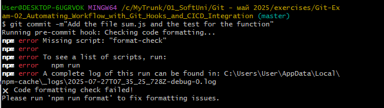
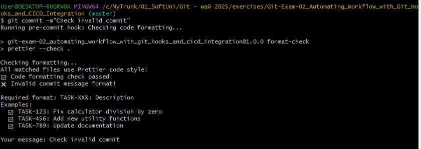
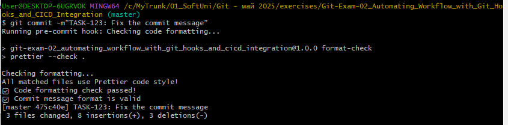
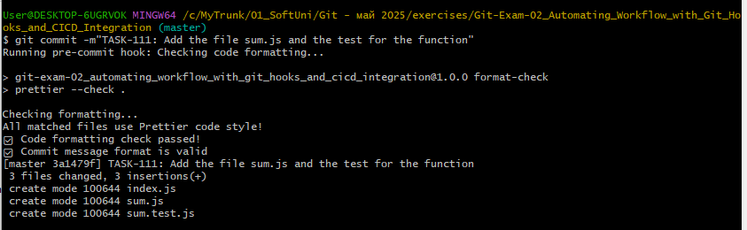
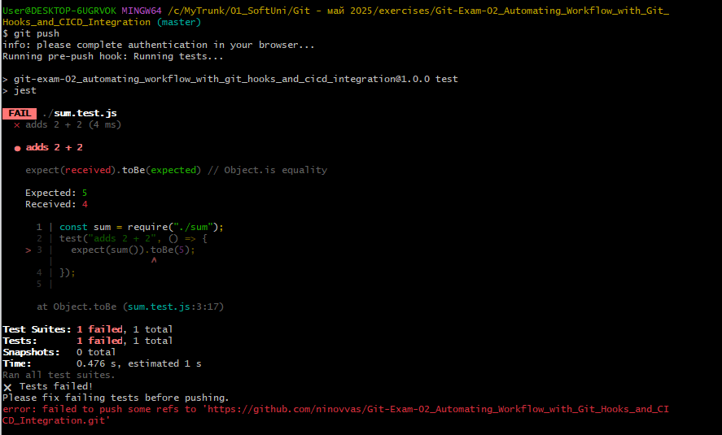
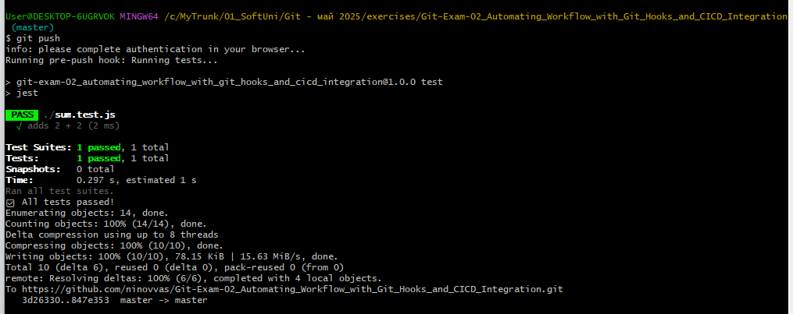
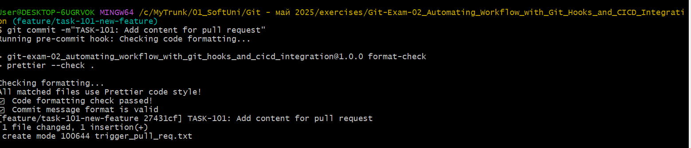
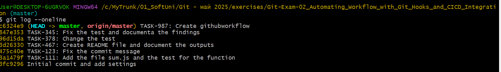
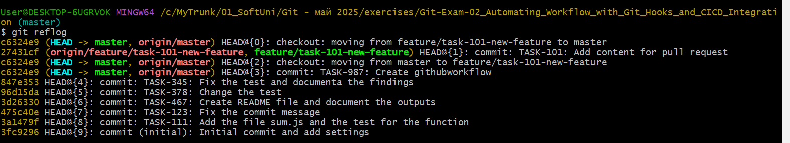

## Commit Failed



## Invalid Commit



## After fixing the commit format



## Valid commit



## Failed test case after change the test



## After fixing the test and push to repo



## Runing checks on the branches created for pull request



## Git log



## Git reflog



## Commends usage to solve the task:

```bash
git init
npm init -y
npm install --save-dev prettier
npm install --save-dev jest
git status
echo 'node_modules/' > .gitignore
echo 'npm-debug.log*' >> .gitignore
echo '.env' >> .gitignore
echo 'dist/' >> .gitignore
echo 'build/' >> .gitignore
echo 'node_modules/' > .prettierignore
echo 'dist/' >> .prettierignore
echo 'build/' >> .prettierignore
echo '*.min.js' >> .prettierignore
git status
git add .
git commit -m"Initial commit and add settings"
echo 'console.log("Hello World!")' > index.js
echo 'module.exports = () => 2 + 2;' > sum.js
echo 'const sum = require("./sum"); test("adds 2 + 2", () => { expect(sum()).toBe(4); });' > sum.test.js
git status
git add .
git commit -m"Add the file sum.js and the test for the function"
npm run format
git commit -m"TASK-111: Add the file sum.js and the test for the function"
git status
git add .
git commit -m"Check invalid commit"
git commit -m"TASK:123: Fix the commit message"
git commit -m"TASK-123: Fix the commit message"
echo README.md
echo > README.md
git status
git add .
git commit -m"TASK-467: Create README file and document the outputs"
npm run format
git status
git add .
git commit -m"TASK-467: Create README file and document the outputs"
git remote add origin https://github.com/ninovvas/Git-Exam-02_Automating_Workflow_with_Git_Hooks_and_CICD_Integration.git
git push -u origin master
git status
git push
git status
git add .
git commit -m"TASK-378: Change the test"
git push
git status
git add .
git commit -m"TASK-345: Fix the test and documenta the findings"
git push
git status
git add .
git commit -m"TASK-987: Create githubworkflow"
npm run format
git status
git add .
git commit -m"TASK-987: Create githubworkflow"
git push
git checkout -b feature/task-101-new-feature
echo "Do Pull request" > trigger_pull_req.txt
git add .
git commit -m"TASK-101: Add content for pull request"
git push -u origin feature/task-101-new-feature
git checkout master
git status
git log --oneline
git reflog
```
